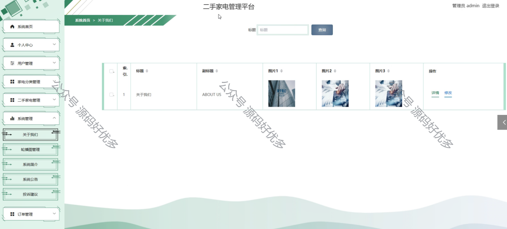

 
## 查看主页获取源码

> **作者介绍**： **✌**全网粉丝10W+本平台特邀作者、博客专家、CSDN新星计划导师、java领域优质创作者,博客之星、掘金/华为云/阿里云/InfoQ等平台优质作者、专注于项目实战 **✌**

  

### 一、作品包含

源码+数据库+设计文档万字+PPT+全套环境和工具资源+部署教程

### 二、项目技术

前端技术：Html、Css、Js、Vue、Element-ui

数据库：MySQL

后端技术：Java、Spring Boot、MyBatis

  

### 三、运行环境

开发工具：IDEA/eclipse

数据库：MySQL5.7

数据库管理工具：Navicat10以上版本

环境配置软件： JDK1.8+Maven3.6.3

前端Nodejs：14

### 四、项目介绍
项目编号：springbootA080

时代在飞速进步，每个行业都在努力发展现在先进技术，通过这些先进的技术来提高自己的水平和优势，二手家电管理平台当然不能排除在外。二手家电管理平台是在实际应用和软件工程的开发原理之上，运用java语言以及前台VUE框架，后台SpringBoot框架进行开发。首先要进行需求分析，分析出二手家电管理平台的主要功能，然后设计了系统结构。整体设计包括系统的功能、系统总体结构、系统数据结构和对系统安全性进行设计；最后要对系统进行测试，还要对测试的结果进行总结和分析，为以后系统的维护提供方便，也为以后类似系统的开发提供参考和帮助。这种个性化的网络系统管理更重视相互协调和管理合作,能激发管理者的创造性和主动性,这对二手家电管理平台来说非常有益。

### 五、运行截图

  
